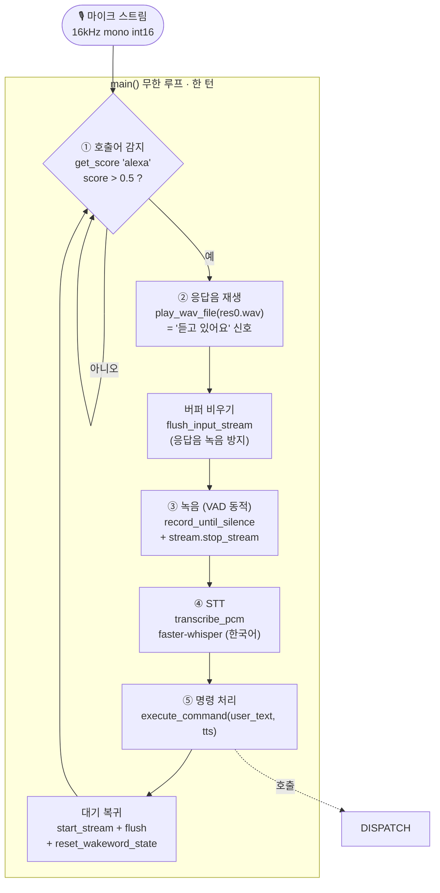
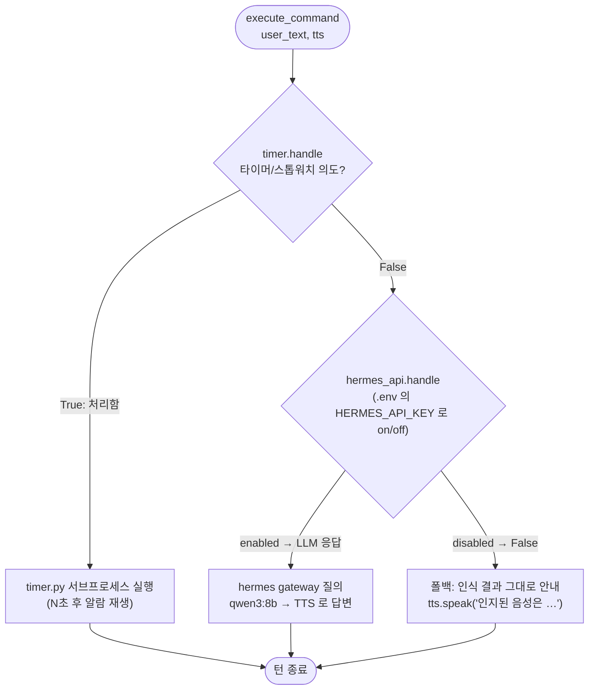

# Home Bser 
home agent mini-project


# Architecture

`main_agent.py` 는 얇은 오케스트레이터입니다. 마이크 입력을 받아 **호출어 감지 → 응답음 → 녹음 → STT → 명령 처리(스킬) → 대기** 순서로 한 턴을 처리하고, 이를 무한히 반복합니다. 각 파이프라인 단계는 `agent/` 패키지의 모듈로 분리되어 있고, `main_agent.py` 는 이들을 연결만 합니다.

## 파이프라인 (메인 루프)



## 명령 처리 = 스킬 디스패처

`execute_command()` 는 `SKILLS` 레지스트리를 **순서대로** 순회하며, 각 스킬의 `handle(user_text, tts) -> bool` 을 호출합니다. `True`(= 내가 처리함)를 반환하는 첫 스킬에서 멈춥니다. **순서가 중요**합니다 — `hermes_api` 는 문장을 가리지 않는 catch-all 이므로 반드시 마지막에 둡니다.



> 새 기능 추가 = `handle(user_text, tts)` 함수를 작성해 `SKILLS` 리스트에 등록하면 끝입니다. (루프 코드는 그대로) 단, catch-all 인 `hermes_api.handle` 앞에 등록하세요.

## 모듈 구성

| 단계 | 모듈 | 핵심 함수 |
| --- | --- | --- |
| 진입점/오케스트레이터 | `main_agent.py` | `main()`, `execute_command()` |
| 설정·환경 프리셋 | `agent/config.py` | `parse_device_args()`, `load_env_file()` |
| 오디오 I/O | `agent/audio_io.py` | `open_input_stream()`, `record_frames()`, `play_wav_file()`, `resolve_devices()` |
| 호출어 감지 | `agent/wakeword.py` | `load_wakeword_model()`, `get_score()` |
| STT (음성→텍스트) | `agent/stt.py` | `load_stt_model()`, `transcribe_pcm()` |
| TTS (텍스트→음성) | `agent/tts.py` | `TextToSpeech.speak()` |
| 스킬: 타이머 | `agent/skills/timer.py` | `handle()`, `check_timer_intent()` |
| 스킬: LLM (catch-all) | `agent/skills/hermes_api.py` | `handle()`, `ask()`, `is_enabled()` |

> 모델(Wake Word / STT / TTS)은 import 시점이 아니라 `main()` 안에서 **한 번만** 로드됩니다. 덕분에 다른 스크립트가 `agent` 하위 모듈을 개별 import 해도 전체 파이프라인이 딸려오지 않습니다.


# Python venv
```bash
mkdir home-bser
cd home-bser
python3 -m venv .
```

## Python package
```bash
# it must be executed in venv
pip3 install pyaudio numpy openwakeword faster-whisper
pip3 install nvidia-cublas-cu12 "nvidia-cudnn-cu12==9.20.*"
pip3 install requests
pip3 install torch transformers scipy
pip3 install uroman
pip3 install silero-vad   # 발화 종료 감지(VAD endpointing). 모델을 번들해 오프라인 로드
```

> **cuDNN 버전 핀 주의**
> `nvidia-cudnn-cu12` 는 반드시 **torch 가 빌드된 cuDNN 버전과 일치**해야 합니다.
> 버전을 고정하지 않고 최신을 받으면 torch(예: cuDNN 9.20)와 pip 런타임(예: 9.24)이
> 어긋나 TTS(conv1d) 실행 시 `CUDNN_STATUS_SUBLIBRARY_VERSION_MISMATCH` 로 죽습니다.
> torch 가 요구하는 버전은 아래로 확인하고 핀을 맞추세요.
> ```bash
> # torch 가 빌드된 cuDNN 버전 (예: 92000 = 9.20.0)
> python -c "import torch; print(torch.backends.cudnn.version())"
> # torch 가 의존성으로 요구하는 정확한 핀
> python -c "import importlib.metadata as m; print([r for r in m.requires('torch') if 'cudnn' in r.lower()])"
> ```

## How to run
```bash
# it must be executed in venv
# --environment 로 실행 환경 프리셋을 선택합니다 (dev | prod, 기본값: dev)
python main_agent.py                    # 기본 dev (cpu, mic index 0)
python main_agent.py --environment dev  # 개발환경: cpu, mic index 0
python main_agent.py --environment prod # 운영환경: cpu STT/TTS, USB 장치를 이름으로 탐색
python main_agent.py --list-devices     # 입출력 장치 이름/인덱스 확인
python main_agent.py --debug-record     # 매 턴 녹음 원본을 debug_record.wav 로 저장 (진단용)
```
- `--environment` 프리셋은 STT/TTS 실행 디바이스와 마이크·스피커 장치를 함께 결정합니다.
  - `dev` — `device=cpu`, 마이크 인덱스 `0`, 기본 스피커
  - `prod` — `device=cpu`, 마이크/스피커를 **이름**(`"USB"`)으로 탐색
- STT/TTS 는 모든 환경에서 CPU 로 동작합니다. GPU(cuda) 는 추후 로컬 LLM 스테이지 전용으로 남겨둡니다.
- 프로그램 로드 시 선택된 환경이 로그로 출력됩니다. (예: `[System] 실행 환경: ...`)
- STT(Faster-Whisper) compute_type 은 디바이스에 따라 자동 설정됩니다. (cuda: float16, cpu: int8) — 현재는 두 프리셋 모두 cpu 이므로 항상 int8.

### 장치 선택 (인덱스가 아니라 이름으로)
PortAudio 는 장치 인덱스를 열거 순서대로 부여하므로, USB 마이크/스피커의 인덱스는 **재부팅·재연결 때마다 바뀝니다** (하드코딩한 `2` 는 깨짐). 그래서 `prod` 프리셋은 인덱스 대신 이름 패턴(`input_device_name` / `output_device_name`)을 들고 있고, 시작 시 `resolve_devices()` 가 이를 실제 인덱스로 해석합니다.

- 이름 없음(`dev`) → 프리셋의 인덱스(`0` / 기본)를 그대로 사용.
- 이름이 일치 → 그 인덱스를 사용하고 매칭을 로그로 남김. 여러 개 일치하면 첫 번째를 선택.
- 이름이 아무것도 매칭 안 됨 → 경고 후 장치 목록을 출력하고 프리셋 인덱스(`None` = 시스템 기본)로 폴백. 즉 USB 장치가 없어도 크래시 대신 degrade 됩니다.

이름 패턴은 코드 수정 없이 `.env` 로 덮어쓸 수 있습니다 (`AUDIO_INPUT_NAME`, `AUDIO_OUTPUT_NAME`; 빈 값이면 프리셋으로 폴백). 대상 머신의 실제 장치 이름은 `--list-devices` 로 확인하세요.

### 진단 (오디오 품질 / 응답 지연)
녹음이 끝나고 "🛑 녹음 완료!" 이후 응답이 오래 걸리거나 인식 결과가 엉뚱할 때, 원인이 **오디오 품질**인지 **STT 속도**인지 구분하는 것이 먼저입니다. 메인 루프는 매 턴 아래 계측을 로그로 남깁니다.

```
🛑 녹음 완료! (오디오 5.2초 / 녹음대기 5.2초) 생각 중...
[System] STT 전사 소요: 17.3초
```
- **오디오 초** — 실제로 녹음된 발화 길이. `STT_MAX_RECORD_SECONDS`(15초)에 붙어 있으면 VAD 가 발화 끝을 못 잡고 상한까지 녹음한 것.
- **STT 전사 소요** — faster-whisper 가 전사에 쓴 시간. 오디오 길이보다 크게 길면(예: 5초 오디오에 17초) 정상 아님. 오디오가 뭉개져 있으면 whisper 가 temperature fallback 으로 같은 구간을 최대 6번까지 재디코딩해 **느려지면서 동시에 틀린 결과**를 냅니다 — 느림과 오인식이 한 원인(나쁜 입력 오디오)에서 나오는 전형적 패턴입니다.

`--debug-record` 를 주면 매 턴 마이크 원본을 프로젝트 루트의 `debug_record.wav` 로 저장합니다. 이 파일을 재생해(macOS `afplay debug_record.wav`) **소리 자체가 멀쩡한지** 먼저 확인하세요.
- 소리가 뭉개짐/잡음/에코 → 마이크 경로 문제 (네이티브 변환 리샘플, 장치 선택 등).
- 소리는 멀쩡한데 전사만 틀림 → STT 파라미터/모델 쪽에서 접근.

깨끗한 wav 로 오프라인 벤치마크를 하려면 `text_to_wav.py` 로 한국어 샘플을 만들고 `agent/stt.py` 의 `transcribe_pcm` 을 직접 호출해 비교하면 됩니다.

## How to run in production (상시 실행)
SSH 연결이 닫혀도 프로세스가 종료되지 않도록 `nohup` 으로 백그라운드 실행합니다.
`SIGHUP` 을 무시하고 실행되며, 출력은 `agent.log` 로 남습니다.

```bash
# it must be executed in venv
cd /Users/jckang/workspace_vscode/home-bser
nohup ./bin/python main_agent.py --environment prod > agent.log 2>&1 &
```
- `res0.wav`(호출어 응답음) 접근을 위해 반드시 프로젝트 루트에서 실행하세요.
- `./bin/python` 을 직접 지정하면 `source bin/activate` 없이 venv 로 동작합니다.

```bash
tail -f agent.log       # 실시간 로그 확인
pgrep -af main_agent.py # 실행 중인 프로세스 확인
pkill -f main_agent.py  # 프로세스 종료
```
- 자동 재시작·부팅 시 자동 시작이 필요하면 `systemd user service` 사용을 권장합니다.

### How to make requirements
```
# 로컬 오프라인 보이스 에이전트 의존성 (B안: 핵심 패키지만 정리)
#
# 버전 핀 방법:
#   실제 운영 중인 Ubuntu + CUDA GPU 머신의 venv에서 아래 명령으로 버전을 확인 후,
#   각 패키지 뒤에 ==<버전> 을 채워 넣으세요.
#     source bin/activate
#     pip3 freeze | grep -iE 'pyaudio|numpy|openwakeword|faster-whisper|requests|torch|transformers|scipy|uroman'
#
# 설치:
#   pip3 install -r requirements.txt
#   # CUDA 런타임(nvidia-*)은 GPU 환경에서만 아래 별도 섹션 주석을 해제해 설치하세요.

# --- 오디오 I/O ---
pyaudio
numpy
scipy

# --- Wake Word (호출어 감지) ---
openwakeword

# --- STT (음성 인식, CUDA 가속) ---
faster-whisper

# --- VAD (발화 종료 감지, endpointing) ---
silero-vad

# --- TTS (음성 합성) ---
torch
transformers
uroman

# --- 기타 ---
requests

# =========================================================
# CUDA 런타임 (GPU 전용) — Ubuntu + NVIDIA 환경에서만 필요.
# CPU/macOS 머신에서는 설치하지 마세요. 필요 시 주석 해제.
# =========================================================
# nvidia-cublas-cu12
# nvidia-cudnn-cu12==9.20.*   # ★ torch 빌드 cuDNN 버전과 반드시 일치시킬 것
#                            #   (불일치 시 TTS 에서 CUDNN_STATUS_SUBLIBRARY_VERSION_MISMATCH)
#
# 참고: torch 를 CUDA 빌드로 설치하려면 버전 태그(예: torch==2.x.x+cu121)를
#       실제 운영 머신의 pip3 freeze 결과에서 그대로 복사해 위 torch 라인에 반영하세요.
```