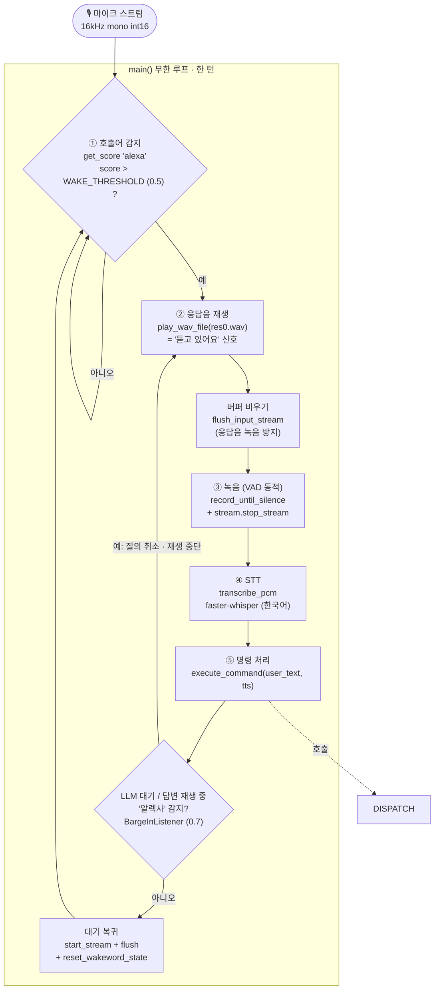

# Home Bser

home agent mini-project — 로컬에서 도는 한국어 음성 비서.

`main_agent.py` 는 얇은 오케스트레이터입니다. **호출어 감지 → 응답음 → 녹음 → STT → 명령 처리(스킬) → 대기** 순서로 한 턴을 처리하고 이를 무한히 반복하며, 각 단계는 `agent/` 패키지의 모듈로 분리되어 있습니다.

> 이 문서는 **무엇을 어떻게 쓰는가**를 다룹니다. **왜 그렇게 되어 있는가**(설계 근거)는 [`CLAUDE.md`](CLAUDE.md), 배치 잡 운영은 [`batch/README.md`](batch/README.md).

# Architecture

## 파이프라인 (메인 루프)


```mermaid
flowchart TD
    MIC([🎙️ 마이크 스트림<br/>16kHz mono int16]) --> WAKE

    subgraph LOOP["main() 무한 루프 · 한 턴"]
        direction TB
        WAKE{"① 호출어 감지<br/>get_score 'alexa'<br/>score &gt; WAKE_THRESHOLD (0.5) ?"}
        WAKE -->|아니오| WAKE
        WAKE -->|예| ACK["② 응답음 재생<br/>play_wav_file(res0.wav)<br/>= '듣고 있어요' 신호"]
        ACK --> FLUSH["버퍼 비우기<br/>flush_input_stream<br/>(응답음 녹음 방지)"]
        FLUSH --> REC["③ 녹음 (VAD 동적)<br/>record_until_silence<br/>+ stream.stop_stream"]
        REC --> STT["④ STT<br/>transcribe_pcm<br/>faster-whisper (한국어)"]
        STT --> EXEC["⑤ 명령 처리<br/>execute_command(user_text, tts)"]
        EXEC --> BARGE{"LLM 대기 / 답변 재생 중<br/>'알렉사' 감지?<br/>BargeInListener (0.7)"}
        BARGE -->|"예: 질의 취소 · 재생 중단"| ACK
        BARGE -->|아니오| RESET["대기 복귀<br/>start_stream + flush<br/>+ reset_wakeword_state"]
        RESET --> WAKE
    end

    EXEC -.호출.-> DISPATCH
```

⑤ 에서 **LLM 이 답을 만드는 동안**과 **답변을 읽어주는 동안** 마이크가 열려 있어, "알렉사"를 부르면 진행 중이던 질의·재생이 즉시 중단되고 곧바로 ② 로 이어집니다(대기 상태로 돌아가지 않습니다 — 이미 호출어를 말했으므로). 조정은 아래 [끼어들기](#끼어들기-조정-env) 참고.

## 명령 처리 = 스킬 디스패처

`execute_command()` 는 `SKILLS` 레지스트리를 **순서대로** 순회하며 각 스킬의 `handle(user_text, tts) -> bool` 을 호출하고, `True`(= 내가 처리함)를 반환하는 첫 스킬에서 멈춥니다.


```mermaid
flowchart TD
    START([execute_command<br/>user_text, tts]) --> TIMER

    TIMER{"timer.handle<br/>타이머/스톱워치 의도?"}
    TIMER -->|True: 처리함| TIMER_DO["timer.py 서브프로세스 실행<br/>(N초 후 알람 재생)"] --> DONE([턴 종료])
    TIMER -->|False| CLAUDE

    CLAUDE{"claude_p.handle<br/>(.env 의 CLAUDE_CLI_ENABLED 로 on/off)"}
    CLAUDE -->|enabled → LLM 응답| CLAUDE_DO["claude --print 질의<br/>웹 검색 허용 → TTS 로 답변"] --> DONE
    CLAUDE -->|disabled / claude 명령 없음 → False| HERMES

    HERMES{"hermes_api.handle<br/>(.env 의 HERMES_ENABLED 로 on/off)"}
    HERMES -->|enabled → LLM 응답| HERMES_DO["hermes gateway 질의<br/>qwen3:8b → TTS 로 답변"] --> DONE
    HERMES -->|disabled → False| ECHO

    ECHO["폴백: 인식 결과 그대로 안내<br/>tts.speak('인지된 음성은 …')"] --> DONE
```

**순서가 중요합니다.** `claude_p` 와 `hermes_api` 는 문장을 가리지 않는 catch-all(LLM) 스킬이라 구체적인 스킬 **뒤에** 둡니다. 둘 다 `.env` 스위치로 꺼지면 `False` 를 반환하므로 **claude → hermes → 에코 폴백** 순으로 degrade 합니다.

> 새 기능 추가 = `handle(user_text, tts)` 함수를 작성해 `SKILLS` 리스트에 등록하면 끝입니다(루프 코드는 그대로). 단, catch-all **앞에** 등록하세요.

## 모듈 구성

| 단계 | 모듈 | 핵심 함수 |
| --- | --- | --- |
| 진입점/오케스트레이터 | `main_agent.py` | `main()`, `execute_command()` |
| 설정·환경 프리셋 | `agent/config.py`, `agent/run_config.py` | `parse_device_args()`, `load_env_file()`, `RunConfig` |
| 오디오: 장치 탐색 | `agent/audio_device.py` | `resolve_devices()`, `find_device_by_name()`, `list_input_devices()` |
| 오디오: 입력(녹음) | `agent/audio_record.py`, `agent/mic_stream.py` | `open_input_stream()`, `record_until_silence()`, `MicStream` |
| 오디오: 출력(재생) | `agent/audio_play.py` | `play_wav_file()` |
| 오디오: 포맷 변환 공용 | `agent/audio_format.py` | `supports_format()`, `downmix_to_mono()` |
| 호출어 감지 | `agent/wakeword.py` | `load_wakeword_model()`, `get_score()`, `reset_wakeword_state()` |
| 끼어들기 (barge-in) | `agent/barge_in_listener.py`, `agent/barge_in_cancelled.py`, `agent/wait.py` | `BargeInListener.start()`, `.stop()`, `.triggered`, `BargeInCancelled`, `wait_for_completion()` |
| STT (음성→텍스트) | `agent/stt.py` | `load_stt_model()`, `transcribe_pcm()` |
| VAD (발화 종료 감지) | `agent/silero_vad.py` | `SileroVAD.load()`, `.is_speech()` |
| TTS (텍스트→음성) | `agent/text_to_speech.py`, `agent/silent_text_to_speech.py` | `TextToSpeech.speak()`, `SilentTextToSpeech` (무음 테스트용) |
| TTS 입력 정규화 | `agent/text_norm.py` | `normalize_for_tts()`, `english_to_hangul()`, `normalize_numbers()` |
| 스킬: 타이머 | `agent/skills/timer.py` | `handle()`, `check_timer_intent()` |
| 스킬: LLM · Claude CLI (catch-all) | `agent/skills/claude_p.py` | `handle()`, `ask()`, `is_enabled()`, `build_command()` |
| 스킬: LLM · hermes (catch-all) | `agent/skills/hermes_api.py` | `handle()`, `ask()`, `is_enabled()` |
| 배치: 설정 | `batch/config.py` | `load_batch_env()`, `read_topics()`, `read_url()`, `output_path()` |
| 배치: claude 질의 (프롬프트는 잡이 넘김) | `batch/claude_query.py` | `ask()`, `build_command()` |
| 배치: gemini 질의 (claude 판과 같은 규약) | `batch/gemini_query.py` | `ask()`, `build_command()`, `is_enabled()`, `log_usage()` |
| 배치: 마크다운 보정 (공용) | `batch/markdown_fix.py` | `fix_bullets()` |
| 배치: 정기 LLM 요약 | `batch/daily_briefing.py` | `SYSTEM_PROMPT`, `main()`, `summarize_topic()` |
| 배치: URL 브리핑 | `batch/url_briefing.py` | `SYSTEM_PROMPT`, `main()`, `summarize_url()`, `site_label()` |
| 배치: URL 브리핑 (gemini 판) | `batch/url_briefing_gemini.py` | `main()`, `summarize_url()` — 나머지는 `url_briefing` 에서 가져다 씀 |
| 배치: Discord 알림 (공용) | `batch/discord_notify.py` | `notify()`, `send()`, `truncate()`, `is_enabled()` |

> 모델(Wake Word / STT / TTS)은 import 시점이 아니라 `main()` 안에서 **한 번만** 로드됩니다. 덕분에 다른 스크립트가 `agent` 하위 모듈을 개별 import 해도 전체 파이프라인이 딸려오지 않습니다.
>
> 파일이 잘게 나뉘어 있는 이유는 **한 파일에 클래스 하나, 또는 클래스 없이 함수 여럿** 규칙 때문입니다 (`CLAUDE.md` 의 "Python 코드 규칙"). 클래스 파일명은 클래스명의 snake_case 입니다 — `agent/mic_stream.py` → `MicStream`.

# 설치

```bash
mkdir home-bser && cd home-bser
python3 -m venv .            # 저장소 루트가 곧 venv 입니다
```

의존성 목록의 **정본은 [`requirements.txt`](requirements.txt)** 입니다. 이 문서에 같은 목록을 다시 적지 않습니다(예전에 양쪽에 두었다가 어긋난 적이 있습니다). 패키지 추가는 그 파일만 고치세요.

```bash
# venv 안에서 실행
pip3 install -r requirements.txt

# GPU(Ubuntu + NVIDIA) 환경에서만 추가 설치 (CPU/macOS 에서는 설치하지 말 것)
pip3 install nvidia-cublas-cu12 "nvidia-cudnn-cu12==9.20.*"
```

구성은 오디오 I/O(`pyaudio`·`numpy`·`scipy`) · 호출어(`openwakeword`) · STT(`faster-whisper`) · VAD(`silero-vad`) · TTS(`torch`·`transformers`·`uroman`·`cmudict`) · LLM/배치(`openai`·`requests`) 입니다. `silero-vad` 와 `cmudict` 는 모델·데이터를 휠에 번들해 **런타임 다운로드가 없습니다.**

> **cuDNN 버전 핀 주의** — `nvidia-cudnn-cu12` 는 torch 가 빌드된 버전과 일치해야 합니다. 최신을 그냥 받으면 TTS 실행 시 `CUDNN_STATUS_SUBLIBRARY_VERSION_MISMATCH` 로 죽습니다.
> ```bash
> python -c "import torch; print(torch.backends.cudnn.version())"   # 예: 92000 = 9.20.0
> python -c "import importlib.metadata as m; print([r for r in m.requires('torch') if 'cudnn' in r.lower()])"
> ```

# 실행

```bash
# venv 안에서 실행
python main_agent.py                    # 기본 dev (cpu, mic index 0)
python main_agent.py --environment prod # 운영환경: USB 장치를 이름으로 탐색
python main_agent.py --list-devices     # 입출력 장치 이름/인덱스 확인
python main_agent.py --debug-record     # 매 턴 녹음 원본을 debug_record.wav 로 저장
python main_agent.py --off-speaker "오늘 날씨는 어때?"   # 마이크/스피커 없이 문장 하나만
```

`--environment` 프리셋(`dev` | `prod`, 기본 `dev`)이 STT/TTS 실행 디바이스와 마이크·스피커를 함께 결정합니다.

| 프리셋 | 디바이스 | 마이크 / 스피커 |
| --- | --- | --- |
| `dev` | cpu | 인덱스 `0` / 기본 스피커 |
| `prod` | cpu | 이름(`"USB"`)으로 탐색 |

STT/TTS 는 모든 환경에서 CPU 로 돕니다(GPU 는 추후 로컬 LLM 스테이지용). faster-whisper 의 `compute_type` 은 디바이스에서 자동 결정되고(cuda: float16, cpu: int8), 선택된 환경은 시작 시 `[System] 실행 환경: …` 로 출력됩니다.

## 무음 테스트 (`--off-speaker`)

마이크에 대고 말하지 않고 **문장 하나만** 넣어 스킬 라우팅과 LLM 응답을 확인합니다.

```bash
python main_agent.py --off-speaker "대한민국의 수도는 어디야?"
```
```
[System] 무음 테스트 모드(--off-speaker): 마이크/스피커를 쓰지 않고 호출어·STT·TTS 를 건너뜁니다.
[사용자 입력]: "대한민국의 수도는 어디야?"
-> claude CLI 에 질문합니다: 대한민국의 수도는 어디야?
[응답] 대한민국의 수도는 서울입니다. (4.89초)
🔇 [무음 응답] 대한민국의 수도는 서울입니다.
[System] 처리 소요: 4.9초
```

오디오 장치를 열지 않고 whisper·VITS 도 로드하지 않으므로 **즉시 실행**되고, 마이크/스피커가 없는 머신(CI·SSH)에서도 동작합니다. 소리를 내는 경로는 모두 함께 막힙니다 — 타이머 알람 서브프로세스도 뜨지 않고 LLM 대기음도 재생되지 않습니다. 처리 후 바로 종료합니다.

## 장치 선택 (인덱스가 아니라 이름으로)

PortAudio 인덱스는 **재부팅·재연결마다 바뀌므로**(하드코딩한 `2` 는 깨짐) `prod` 프리셋은 이름 패턴을 들고 있고, 시작 시 `resolve_devices()` 가 실제 인덱스로 해석합니다.

- 이름 없음(`dev`) → 프리셋 인덱스를 그대로 사용.
- 이름 일치 → 그 인덱스를 사용하고 로그로 남김. 여러 개면 첫 번째.
- 아무것도 일치하지 않음 → 경고 후 장치 목록을 출력하고 프리셋 인덱스로 폴백(크래시 대신 degrade).

매칭은 대소문자를 무시하는 **접두사 일치**이고, ALSA 가 붙이는 `(hw:N,M)` 꼬리표는 패턴과 장치 이름 양쪽에서 떼어낸 뒤 비교합니다(카드 번호가 부팅마다 바뀌기 때문). 접두사로 하나도 못 찾으면 부분일치로 폴백합니다(로그에 `부분일치 폴백`).

이름 패턴은 `.env` 로 덮어쓸 수 있습니다(`AUDIO_INPUT_NAME`, `AUDIO_OUTPUT_NAME`). 실제 장치 이름은 `--list-devices` 로 확인하고, 끝의 `(hw:N,M)` 은 빼고 적어도 됩니다.

## 끼어들기 조정 (`.env`)

호출어 감시는 기본으로 켜져 있고, 걸리는 구간은 두 곳입니다.

| 구간 | 끼어들면 |
| --- | --- |
| LLM 응답 대기 (대기음이 울리는 동안) | `claude` 프로세스를 죽이거나(claude CLI) 응답을 버리고(hermes) 질의를 취소 |
| 답변 합성·재생 | 재생을 청크 경계에서 즉시 중단 (~46ms) |

| 키 | 기본값 | 설명 |
| --- | --- | --- |
| `BARGE_IN_ENABLED` | `1` | `0` 이면 재생이 끝나야 호출어가 먹히는 기존 동작 |
| `BARGE_IN_THRESHOLD` | `0.7` | 재생 중 호출어 임계값 (대기 상태는 `WAKE_THRESHOLD` = 0.5) |

임계값을 대기 상태보다 높게 잡는 이유는 **에코 제거(AEC)가 없기** 때문입니다 — 재생 중에는 자기 답변이 마이크로 되돌아와, 같은 값을 쓰면 자기 목소리에 스스로 깨어납니다. 적정값은 마이크와 스피커의 거리에 따라 다릅니다.

- 부르지도 않았는데 답변이 자꾸 끊긴다 → 올린다 (0.8~0.9).
- 불러도 잘 안 끊긴다 → 낮춘다 (0.6).

```
[System] 재생 중 끼어들기(barge-in): 켜짐 (임계값 0.70)
✋ [끼어들기] 호출어 감지 (score 0.83) — 재생을 멈춥니다.
[System] 사용자 끼어들기 — claude 질의를 취소했습니다 (4.2초 대기 후).
```

> **hermes 는 요청 자체가 취소되지 않습니다** — 블로킹 호출을 밖에서 끊을 수단이 없어 결과만 버립니다(로컬 호출이라 몇 초 안에 스스로 끝납니다). claude CLI 는 자식 프로세스라 실제로 종료시킵니다. **타이머 알람**도 별도 프로세스라 끊기지 않지만, 알람이 울릴 때는 메인 루프가 대기 상태라 호출어가 원래대로 동작합니다.

## LLM 백엔드 설정 (`.env`)

질문에 답하는 catch-all 스킬 둘 다 프로젝트 루트의 **git-ignored `.env`** 로 켭니다(`cp .env.example .env`). 둘 다 꺼져 있으면(= `.env` 없음) 에코 폴백이 동작하므로 개발환경은 설정 없이 그대로 돌아갑니다. 배치 잡은 `batch/.env` 를 따로 읽습니다.

| 백엔드 | 스위치 | 특징 |
| --- | --- | --- |
| Claude Code CLI (`agent/skills/claude_p.py`) | `CLAUDE_CLI_ENABLED=1` | 로컬 `claude --print` 실행. 웹 검색 허용이라 최신 정보도 답변. **클라우드 호출이라 오프라인 아님** |
| hermes gateway (`agent/skills/hermes_api.py`) | `HERMES_ENABLED=1` | 로컬 `qwen3:8b`. 네트워크 경계 기준 오프라인 유지 |

- `CLAUDE_CLI_ENABLED` 는 **미설정 시 꺼짐**입니다 (claude CLI 는 API 키가 필요 없어, 설치만으로 켜지면 모든 발화가 조용히 클라우드로 나가기 때문).
- 그 외 키: `CLAUDE_CLI_MODEL`, `CLAUDE_CLI_EFFORT`, `CLAUDE_CLI_TIMEOUT`(기본 60초), `CLAUDE_CLI_ALLOWED_TOOLS`(기본 `WebSearch,WebFetch`, 비우면 도구 없이 응답).
  - **모델은 전체 이름 권장**(`claude-sonnet-5` 등). 별칭(`sonnet`/`opus`/`haiku`/`fable`)도 받지만 "그 계열의 최신 모델"이라는 뜻이라, 아는 별칭은 실행 시 전체 이름으로 펴서 넘깁니다.
  - **effort**(`low`~`max`)는 낮을수록 빠르고 쌉니다. 음성 응답은 지연이 바로 체감되므로 `low`~`medium` 이 무난하고, 인식할 수 없는 값은 경고 후 무시합니다.
  - 해석된 값은 프로세스당 한 번 로그로 남습니다: `[System] claude CLI 모델: … / effort: …`
- 연결 확인: `python test-claude-cli.py "질문"` / `python test_hermes_api.py "질문"`. 전자는 `--model` / `--effort` 로 같은 값을 시험할 수 있고 `--show-command` 로 실제 명령줄을 볼 수 있습니다.

## TTS 발음 정규화 (영문·숫자·기호)

TTS 모델(`mms-tts-kor`)의 토크나이저 vocab 은 **26자**뿐이라, 한국어 외의 문자는 들어갈 길이 없어 세 가지가 **조용히** 깨집니다.

| 입력 | 모델이 실제로 받던 것 | 증상 |
| --- | --- | --- |
| `65도` | `do` | 숫자가 통째로 무음 |
| `Fox quiz vex` | `o ui e` | f/q/v/x/z 는 vocab 에 없어 소실 |
| `Netflix` | `netli` | 남은 글자도 **한국어 로마자**로 잘못 읽힘 |
| `20%`, `31℃` | (없음) | 기호 무음 |

그래서 `agent/text_norm.py` 가 합성 직전에 셋 모두를 **한글로** 바꿔 넣습니다.

```bash
# 모델을 로드하지 않고 발음 표기만 확인
python -m agent.text_norm "GPU 8개로 Python 실행" "최고기온 31℃, 강수확률 20%"
```
```
GPU 8개로 Python 실행       ->  지피유 팔개로 파이썬 실행
최고기온 31℃, 강수확률 20%  ->  최고기온 삼십일도, 강수확률 이십퍼센트
```

- **영문** — 관용 표기 사전(`파이썬`, `km`→킬로미터) → 대문자 약어 낱자 읽기(`AI`→에이아이) → CMU 발음사전 음차 → 철자 규칙 폴백(`anthropic`→앤스로픽) 순. 카멜케이스는 분리합니다(`ChatGPT`→챗지피티).
- **숫자** — 한자어 읽기. 소수(`8.5`→팔점오)와 자릿수 쉼표(`1,234`→천이백삼십사)도 처리.
- **기호** — `%`→퍼센트, `℃`→도, `~`→에서 등.
- `--off-speaker` 는 정규화 결과가 원문과 다르면 `🔡 [읽기]` 줄로 함께 출력합니다.

> LLM 스킬의 시스템 프롬프트도 "영문·약어는 한글 음차로"를 요구하므로 답변 대부분은 이미 한글로 옵니다. 이 정규화는 새어 나오는 것을 받는 **안전망**이자, 프롬프트가 닿지 않는 에코 폴백·타이머 문구를 담당합니다.

## 진단 (오디오 품질 / 응답 지연)

응답이 오래 걸리거나 인식이 엉뚱할 때, 원인이 **오디오 품질**인지 **STT 속도**인지 구분하는 것이 먼저입니다. 메인 루프가 매 턴 계측을 남깁니다.

```
🛑 녹음 완료! (오디오 5.2초 / 녹음대기 5.2초) 생각 중...
[System] STT 전사 소요: 17.3초
```

- **오디오 초** — 실제 녹음된 발화 길이. `STT_MAX_RECORD_SECONDS`(15초)에 붙어 있으면 VAD 가 발화 끝을 못 잡은 것.
- **STT 전사 소요** — 오디오 길이보다 크게 길면(5초 오디오에 17초) 정상이 아닙니다. 오디오가 뭉개져 있으면 whisper 가 같은 구간을 최대 6번까지 재디코딩해 **느려지면서 동시에 틀립니다** — 둘은 한 원인(나쁜 입력 오디오)에서 나옵니다.

`--debug-record` 로 매 턴 마이크 원본을 `debug_record.wav` 에 저장합니다. 재생해서(`afplay debug_record.wav`) 소리 자체를 먼저 확인하세요 — 뭉개짐/잡음이면 마이크 경로 문제, 소리는 멀쩡한데 전사만 틀리면 STT 파라미터/모델 쪽입니다. `text_to_wav.py` 로 만든 깨끗한 wav 를 `transcribe_pcm` 으로 전사해 비교하면 기준선이 됩니다.

# 배치 잡

음성 턴 안에서 하기엔 너무 느리거나, 부르지 않아도 돌아야 하는 작업은 `batch/` 에 두고 cron 으로 돌립니다. 실행 방법·설정 키·cron 등록은 [`batch/README.md`](batch/README.md).

| 잡 | 하는 일 | 결과 파일 |
| --- | --- | --- |
| `daily_briefing` | 관심 주제(`BRIEFING_TOPICS`)를 claude CLI 의 웹 검색으로 훑어 요약 | `batch/output/daily_briefing/YYYY-MM-DD-HH.md` |
| `url_briefing` | 커뮤니티 사이트 한 곳을 `WebFetch` 로 열어 지금 올라온 글 요약 | `batch/output/url_briefing/YYYY-MM-DD-HH.md` |
| `url_briefing_gemini` | 위와 **똑같은 프롬프트를 gemini CLI 로** (두 모델 비교용, 기본 꺼짐) | `batch/output/url_briefing_gemini/YYYY-MM-DD-HH.md` |

세 잡의 결과 모양은 같습니다 — 개요 한두 문장 + 항목 6개, 항목 제목은 **Discord 마스크 링크**(`[__"제목"__](<주소>)`). 저장 직후 웹훅이 설정돼 있으면 그 파일을 Discord 로 보냅니다.

```bash
# 저장소 루트에서
cp batch/.env.example batch/.env      # 최초 1회 (루트 .env 와 별개)
./bin/python -m batch.daily_briefing
./bin/python -m batch.url_briefing          # --url / --name 이 추가
./bin/python -m batch.url_briefing_gemini   # 인자 동일

# 웹훅만 따로 확인 (--dry-run 이면 보내지 않고 본문만 출력)
./bin/python -m batch.discord_notify --file batch/output/daily_briefing/2026-07-30-07.md --dry-run
```
```
[System] 2026-07-30 브리핑 시작 — 주제 1개
[1/1] '오픈소스 LLM 동향' 요약 중...
[System] claude CLI 모델: claude-sonnet-5 / effort: low
[System] claude 턴 수: 4 (검색 사용)
[완료] '오픈소스 LLM 동향' (26.6초)
[System] 저장: batch/output/daily_briefing/2026-07-30-07.md
[System] 완료 (26.6초) — 주제 1개 모두 성공
```

- 공통 인자: `--topic`(반복 가능) / `--url` / `--name`, `--stdout`(저장·전송 없이 출력만), `--output 경로`, `--no-notify`(저장만).
- **`python batch/daily_briefing.py` 로는 실행하지 않습니다** — `sys.path[0]` 이 `batch/` 가 되어 `import agent` 가 깨집니다. `-m` 을 쓰세요.
- **요약 분량은 Discord 본문 2000자에서 역산한 값이고, 한 번에 대상 하나가 전제입니다.** 주제나 URL 을 늘리면 메시지 뒤쪽이 잘리므로(파일에는 남음) cron 줄을 나누세요. 넘긴 날에는 로그에 `[경고] 문서가 Discord 본문 상한을 넘었습니다: …` 가 남습니다.
- `claude 턴 수` 는 검색을 실제로 썼는지 보는 가장 싼 지표입니다 — `1` 이면 모델 기억으로만 답한 것이니 `CLAUDE_CLI_ALLOWED_TOOLS` 를 확인하세요 (gemini 판의 신호는 `도구 호출: 0회`).
- 파일명이 시(hour)까지라 같은 시간대의 재실행은 덮어쓰고, 시각을 나눠 건 cron 줄끼리는 따로 쌓입니다.
- 주제 하나가 실패해도 잡 전체를 멈추지 않고 사유를 그 자리에 적습니다. 종료 코드는 `0` 전부 성공 / `1` 설정 문제로 아무것도 안 함 / `2` 문서는 만들었지만 요약·전송이 실패함. 웹훅을 설정하지 않은 것은 실패가 아닙니다(`0`).

## 설정은 `batch/.env` 로 분리됩니다

배치 잡은 루트 `.env` 를 **읽지 않습니다.** `load_batch_env()` 가 먼저 `batch/.env` 를 적재하면 이후 스킬 내부의 `load_env_file()` 호출이 no-op 이 되기 때문입니다. 같은 키 이름을 쓰되 값은 목적에 맞게 다르게 잡습니다 — 예를 들어 `CLAUDE_CLI_TIMEOUT` 은 음성 60초 / 배치 300초(아무도 기다리지 않으므로), `CLAUDE_CLI_EFFORT` 는 음성 `medium` / 배치 `high`.

- `batch/.env` 가 **없으면** 잡이 종료 코드 1 로 끝납니다 — 루트 `.env` 로 조용히 도는 일은 없습니다.
- 실제 환경변수가 `.env` 보다 우선이라 일회성 덮어쓰기가 됩니다: `CLAUDE_CLI_EFFORT=low ./batch/run.sh`
- `batch/.env` 는 `.gitignore` 의 `.env` 패턴에 이미 걸립니다. `batch/output/` 과 `batch/logs/` 도 무시됩니다.
- 키 목록과 설명은 [`batch/.env.example`](batch/.env.example) 주석에 있습니다.

## cron 등록

```bash
chmod +x batch/run.sh
crontab -e
```
```cron
# 매일 07:00 브리핑
0 7 * * * /path/to/home-bser/batch/run.sh daily_briefing
```

`batch/run.sh` 가 cron 특유의 문제 셋을 대신 처리합니다 — **cwd**(저장소 루트로 이동), **PATH**(cron 의 PATH 는 최소한이라 `claude` 를 못 찾기 쉬움), **로그**(`batch/logs/YYYY-MM-DD.log`). 잡별 환경변수 덮어쓰기, `%` 이스케이프, gemini 의 PATH·인증 문제 등 나머지는 [`batch/README.md`](batch/README.md).

> 등록 직후에는 cron 을 기다리지 말고 `./batch/run.sh` 를 직접 한 번 돌려보세요. claude CLI 는 로그인 인증을 쓰므로, 대화형 셸에서 되던 것이 cron 환경에서는 실패할 수 있습니다.

# 상시 실행 (production)

SSH 연결이 닫혀도 프로세스가 살아 있도록 `nohup` 으로 백그라운드 실행합니다.

```bash
# venv 안에서, 반드시 프로젝트 루트에서 (res0.wav 접근)
nohup ./bin/python main_agent.py --environment prod > agent.log 2>&1 &

tail -f agent.log       # 실시간 로그
pgrep -af main_agent.py # 실행 중인 프로세스
pkill -f main_agent.py  # 종료
```

`./bin/python` 을 직접 지정하면 `source bin/activate` 없이 venv 로 동작합니다. 자동 재시작·부팅 시 자동 시작이 필요하면 `systemd user service` 를 권장합니다.

## 의존성 핀 갱신

버전 핀은 [`requirements.txt`](requirements.txt) 안에서 관리합니다(설치 방법·CUDA 런타임 주석·핀 확인 명령이 모두 그 파일 상단에 있습니다).

```bash
# 운영 머신의 실제 설치 버전 확인 → requirements.txt 의 핀을 그 값으로 수정
source bin/activate
pip3 freeze | grep -iE 'pyaudio|numpy|scipy|openwakeword|faster-whisper|silero-vad|torch|transformers|uroman|cmudict|openai|requests'
```
