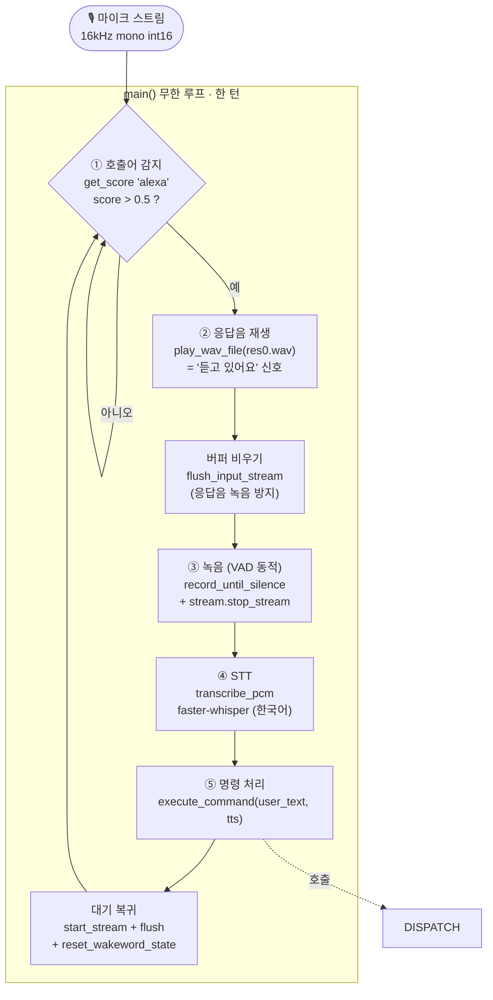
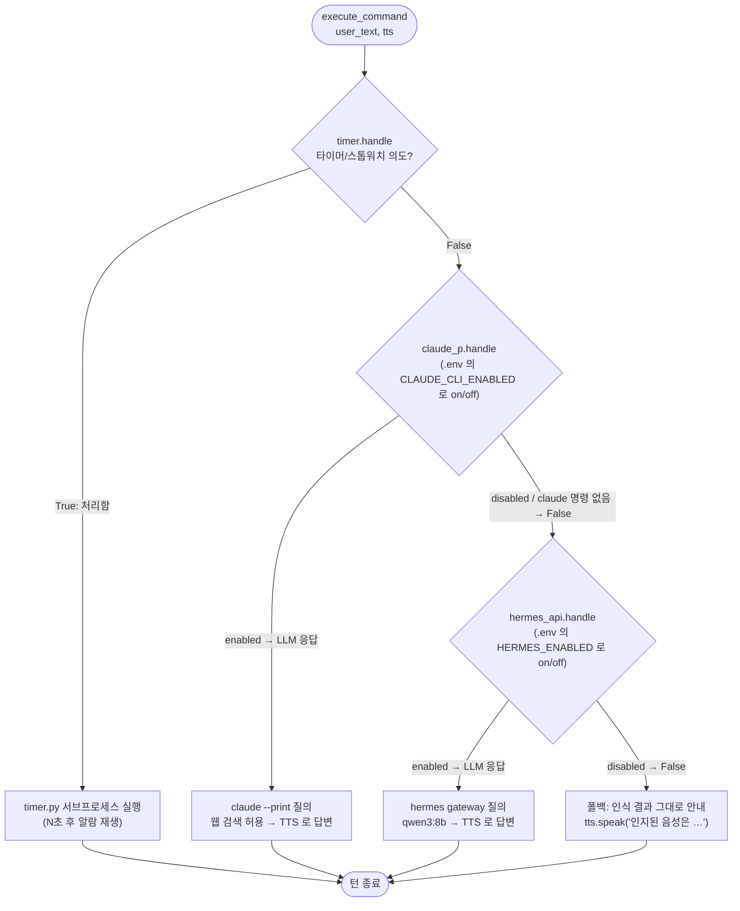

# Home Bser 
home agent mini-project


# Architecture

`main_agent.py` 는 얇은 오케스트레이터입니다. 마이크 입력을 받아 **호출어 감지 → 응답음 → 녹음 → STT → 명령 처리(스킬) → 대기** 순서로 한 턴을 처리하고, 이를 무한히 반복합니다. 각 파이프라인 단계는 `agent/` 패키지의 모듈로 분리되어 있고, `main_agent.py` 는 이들을 연결만 합니다.

## 파이프라인 (메인 루프)


```mermaid
flowchart TD
    MIC([🎙️ 마이크 스트림<br/>16kHz mono int16]) --> WAKE

    subgraph LOOP["main() 무한 루프 · 한 턴"]
        direction TB
        WAKE{"① 호출어 감지<br/>get_score 'alexa'<br/>score &gt; 0.5 ?"}
        WAKE -->|아니오| WAKE
        WAKE -->|예| ACK["② 응답음 재생<br/>play_wav_file(res0.wav)<br/>= '듣고 있어요' 신호"]
        ACK --> FLUSH["버퍼 비우기<br/>flush_input_stream<br/>(응답음 녹음 방지)"]
        FLUSH --> REC["③ 녹음 (VAD 동적)<br/>record_until_silence<br/>+ stream.stop_stream"]
        REC --> STT["④ STT<br/>transcribe_pcm<br/>faster-whisper (한국어)"]
        STT --> EXEC["⑤ 명령 처리<br/>execute_command(user_text, tts)"]
        EXEC --> RESET["대기 복귀<br/>start_stream + flush<br/>+ reset_wakeword_state"]
        RESET --> WAKE
    end

    EXEC -.호출.-> DISPATCH
```

## 명령 처리 = 스킬 디스패처

`execute_command()` 는 `SKILLS` 레지스트리를 **순서대로** 순회하며, 각 스킬의 `handle(user_text, tts) -> bool` 을 호출합니다. `True`(= 내가 처리함)를 반환하는 첫 스킬에서 멈춥니다. **순서가 중요**합니다 — `claude_p` 와 `hermes_api` 는 문장을 가리지 않는 catch-all(LLM) 스킬이므로 구체적인 스킬들 **뒤에** 둡니다.


```mermaid
flowchart TD
    START([execute_command<br/>user_text, tts]) --> TIMER

    TIMER{"timer.handle<br/>타이머/스톱워치 의도?"}
    TIMER -->|True: 처리함| TIMER_DO["timer.py 서브프로세스 실행<br/>(N초 후 알람 재생)"] --> DONE([턴 종료])
    TIMER -->|False| CLAUDE

    CLAUDE{"claude_p.handle<br/>(.env 의 CLAUDE_CLI_ENABLED 로 on/off)"}
    CLAUDE -->|enabled → LLM 응답| CLAUDE_DO["claude --print 질의<br/>웹 검색 허용 → TTS 로 답변"] --> DONE
    CLAUDE -->|disabled / claude 명령 없음 → False| HERMES

    HERMES{"hermes_api.handle<br/>(.env 의 HERMES_ENABLED 로 on/off)"}
    HERMES -->|enabled → LLM 응답| HERMES_DO["hermes gateway 질의<br/>qwen3:8b → TTS 로 답변"] --> DONE
    HERMES -->|disabled → False| ECHO

    ECHO["폴백: 인식 결과 그대로 안내<br/>tts.speak('인지된 음성은 …')"] --> DONE
```

- `claude_p` 를 앞에 두는 이유: Claude Code CLI 는 웹 검색(WebSearch/WebFetch)을 쓸 수 있어 답변 범위가 넓습니다. 로컬 LLM(`hermes`)은 claude 를 껐거나 CLI 가 없을 때의 폴백으로 뒤에 남깁니다.
- 둘 다 `.env` 스위치로 꺼져 있으면 `False` 를 반환하므로 **claude → hermes → 에코 폴백** 순으로 degrade 합니다. `CLAUDE_CLI_ENABLED` 는 미설정 시 **꺼짐**이라 기존 동작에 영향이 없습니다.

> 새 기능 추가 = `handle(user_text, tts)` 함수를 작성해 `SKILLS` 리스트에 등록하면 끝입니다. (루프 코드는 그대로) 단, catch-all 인 `claude_p.handle` / `hermes_api.handle` **앞에** 등록하세요.

## 모듈 구성

| 단계 | 모듈 | 핵심 함수 |
| --- | --- | --- |
| 진입점/오케스트레이터 | `main_agent.py` | `main()`, `execute_command()` |
| 설정·환경 프리셋 | `agent/config.py` | `parse_device_args()`, `load_env_file()` |
| 오디오 I/O | `agent/audio_io.py` | `open_input_stream()`, `record_frames()`, `play_wav_file()`, `resolve_devices()` |
| 호출어 감지 | `agent/wakeword.py` | `load_wakeword_model()`, `get_score()` |
| STT (음성→텍스트) | `agent/stt.py` | `load_stt_model()`, `transcribe_pcm()` |
| TTS (텍스트→음성) | `agent/tts.py` | `TextToSpeech.speak()`, `SilentTextToSpeech` (무음 테스트용) |
| TTS 입력 정규화 | `agent/text_norm.py` | `normalize_for_tts()`, `english_to_hangul()`, `normalize_numbers()` |
| 스킬: 타이머 | `agent/skills/timer.py` | `handle()`, `check_timer_intent()` |
| 스킬: LLM · Claude CLI (catch-all) | `agent/skills/claude_p.py` | `handle()`, `ask()`, `is_enabled()`, `build_command()` |
| 스킬: LLM · hermes (catch-all) | `agent/skills/hermes_api.py` | `handle()`, `ask()`, `is_enabled()` |

> 모델(Wake Word / STT / TTS)은 import 시점이 아니라 `main()` 안에서 **한 번만** 로드됩니다. 덕분에 다른 스크립트가 `agent` 하위 모듈을 개별 import 해도 전체 파이프라인이 딸려오지 않습니다.


# Python venv
```bash
mkdir home-bser
cd home-bser
python3 -m venv .
```

## Python package
```bash
# it must be executed in venv
pip3 install pyaudio numpy openwakeword faster-whisper
pip3 install nvidia-cublas-cu12 "nvidia-cudnn-cu12==9.20.*"
pip3 install requests
pip3 install torch transformers scipy
pip3 install uroman
pip3 install silero-vad   # 발화 종료 감지(VAD endpointing). 모델을 번들해 오프라인 로드
pip3 install cmudict      # 영문 → 한글 음차용 발음 사전. 데이터를 번들해 오프라인 로드
```

> **cuDNN 버전 핀 주의**
> `nvidia-cudnn-cu12` 는 반드시 **torch 가 빌드된 cuDNN 버전과 일치**해야 합니다.
> 버전을 고정하지 않고 최신을 받으면 torch(예: cuDNN 9.20)와 pip 런타임(예: 9.24)이
> 어긋나 TTS(conv1d) 실행 시 `CUDNN_STATUS_SUBLIBRARY_VERSION_MISMATCH` 로 죽습니다.
> torch 가 요구하는 버전은 아래로 확인하고 핀을 맞추세요.
> ```bash
> # torch 가 빌드된 cuDNN 버전 (예: 92000 = 9.20.0)
> python -c "import torch; print(torch.backends.cudnn.version())"
> # torch 가 의존성으로 요구하는 정확한 핀
> python -c "import importlib.metadata as m; print([r for r in m.requires('torch') if 'cudnn' in r.lower()])"
> ```

## How to run
```bash
# it must be executed in venv
# --environment 로 실행 환경 프리셋을 선택합니다 (dev | prod, 기본값: dev)
python main_agent.py                    # 기본 dev (cpu, mic index 0)
python main_agent.py --environment dev  # 개발환경: cpu, mic index 0
python main_agent.py --environment prod # 운영환경: cpu STT/TTS, USB 장치를 이름으로 탐색
python main_agent.py --list-devices     # 입출력 장치 이름/인덱스 확인
python main_agent.py --debug-record     # 매 턴 녹음 원본을 debug_record.wav 로 저장 (진단용)
python main_agent.py --off-speaker "오늘 날씨는 어때?"   # 마이크/스피커 없이 문장 하나만 처리 (테스트용)
```
- `--environment` 프리셋은 STT/TTS 실행 디바이스와 마이크·스피커 장치를 함께 결정합니다.
  - `dev` — `device=cpu`, 마이크 인덱스 `0`, 기본 스피커
  - `prod` — `device=cpu`, 마이크/스피커를 **이름**(`"USB"`)으로 탐색
- STT/TTS 는 모든 환경에서 CPU 로 동작합니다. GPU(cuda) 는 추후 로컬 LLM 스테이지 전용으로 남겨둡니다.
- 프로그램 로드 시 선택된 환경이 로그로 출력됩니다. (예: `[System] 실행 환경: ...`)
- STT(Faster-Whisper) compute_type 은 디바이스에 따라 자동 설정됩니다. (cuda: float16, cpu: int8) — 현재는 두 프리셋 모두 cpu 이므로 항상 int8.

### 무음 테스트 (`--off-speaker`)
마이크에 대고 말하지 않고 **문장 하나만** 파이프라인에 넣어 스킬 라우팅과 LLM 응답을 확인합니다.

```bash
python main_agent.py --off-speaker "대한민국의 수도는 어디야?"
```
```
[System] 무음 테스트 모드(--off-speaker): 마이크/스피커를 쓰지 않고 호출어·STT·TTS 를 건너뜁니다.
[사용자 입력]: "대한민국의 수도는 어디야?"
-> claude CLI 에 질문합니다: 대한민국의 수도는 어디야?
[응답] 대한민국의 수도는 서울입니다. (4.89초)
🔇 [무음 응답] 대한민국의 수도는 서울입니다.
[System] 처리 소요: 4.9초
```

- 호출어 감지·녹음·STT·TTS 재생을 모두 건너뛰고, 답변은 `🔇 [무음 응답]` 으로 출력만 합니다.
- 오디오 장치를 열지 않고 whisper·VITS 모델도 로드하지 않으므로 **즉시 실행**되고, 마이크/스피커가 없는 머신(CI·SSH 세션)에서도 동작합니다.
- 소리를 내는 경로는 모두 함께 막힙니다: 타이머 스킬은 알람 서브프로세스(`timer.py`)를 띄우지 않고 무엇을 실행했을지만 로그로 남기고, LLM 스킬의 대기음도 재생되지 않습니다.
- 처리 후 바로 종료합니다(대기 루프로 돌아가지 않음).

### TTS 발음 정규화 (영문·숫자·기호)
TTS 모델(`mms-tts-kor`)의 토크나이저 vocab 은 **26자**(`abcdeghijklmnoprstuwy` + 따옴표류)뿐입니다. 한국어는 uroman 로마자화를 거쳐 들어가지만 그 밖의 문자는 들어갈 길이 없어, 세 가지가 **조용히** 깨집니다.

| 입력 | 모델이 실제로 받던 것 | 증상 |
| --- | --- | --- |
| `65도` | `do` | 숫자가 통째로 무음 |
| `Fox quiz vex` | `o ui e` | f/q/v/x/z 는 vocab 에 없어 소실 |
| `Netflix` | `netli` | 남은 글자도 **한국어 로마자**로 잘못 읽힘 |
| `20%`, `31℃` | (없음) | 기호 무음 |

그래서 `agent/text_norm.py` 가 합성 직전에 셋 모두를 **한글로** 바꿔 넣습니다. 한글로 바꾸는 것이 핵심입니다 — 그래야 문장의 나머지와 똑같이 uroman 을 타서, 모델이 학습한 한국어 로마자 분포 안에 머뭅니다.

```bash
# 모델을 로드하지 않고 발음 표기만 확인
python -m agent.text_norm "GPU 8개로 Python 실행" "최고기온 31℃, 강수확률 20%"
```
```
GPU 8개로 Python 실행       ->  지피유 팔개로 파이썬 실행
최고기온 31℃, 강수확률 20%  ->  최고기온 삼십일도, 강수확률 이십퍼센트
```

- **영문** — 관용 표기 사전(`파이썬`, `도커`, `km`→킬로미터) → 대문자 약어 낱자 읽기(`AI`→에이아이) → CMU 발음사전 기반 음차(외래어 표기법 근사) → 사전에 없으면 철자 규칙 폴백(`anthropic`→앤스로픽) 순으로 시도합니다. 카멜케이스는 분리합니다(`ChatGPT`→챗지피티).
- **숫자** — 한자어 읽기. 소수(`8.5`→팔점오)와 자릿수 쉼표(`1,234`→천이백삼십사)도 처리합니다.
- **기호** — `%`→퍼센트, `℃`→도, `~`→에서 등.
- `--off-speaker` 는 정규화 결과가 원문과 다르면 `🔡 [읽기]` 줄로 함께 출력하므로, 소리 없이도 발음을 확인할 수 있습니다.
- `cmudict` 는 데이터를 번들한 단일 휠(~940KB)이라 **런타임 다운로드가 없고** 오프라인 성질이 유지됩니다. 첫 영단어에서 한 번만(약 0.17초) 지연 로드하며, 패키지가 없으면 경고 후 철자 규칙으로 degrade 합니다.

> LLM 스킬(`claude_p`, `hermes_api`)의 시스템 프롬프트도 "영문·약어는 한글 음차로" 를 요구하므로 답변 대부분은 이미 한글로 옵니다. 이 정규화는 그래도 새어 나오는 것을 받는 **안전망**이자, 프롬프트가 닿지 않는 에코 폴백·타이머 안내 문구를 담당합니다.

### LLM 백엔드 설정 (`.env`)
질문에 답하는 catch-all 스킬은 두 가지이고, 모두 프로젝트 루트의 **git-ignored `.env`** 로 켭니다. `cp .env.example .env` 후 값을 채우세요. 둘 다 꺼져 있으면(= `.env` 없음) 인식 결과를 그대로 읽어주는 에코 폴백이 동작하므로, 개발환경은 설정 없이 그대로 돌아갑니다.

| 백엔드 | 스위치 | 특징 |
| --- | --- | --- |
| Claude Code CLI (`agent/skills/claude_p.py`) | `CLAUDE_CLI_ENABLED=1` | 로컬 `claude --print` 실행. 웹 검색 허용(`WebSearch,WebFetch`)이라 최신 정보도 답변. **클라우드 호출이라 오프라인 아님** |
| hermes gateway (`agent/skills/hermes_api.py`) | `HERMES_ENABLED=1` | 로컬 `qwen3:8b`. 네트워크 경계 기준 오프라인 유지 |

- 둘 다 켜면 `claude_p` 가 먼저 시도되고, 꺼져 있거나 `claude` 명령이 없으면 hermes 로 넘어갑니다.
- `CLAUDE_CLI_ENABLED` 는 **미설정 시 꺼짐**입니다 (claude CLI 는 API 키가 필요 없어, 설치만으로 켜지면 모든 발화가 조용히 클라우드로 나가기 때문).
- 그 외 키: `CLAUDE_CLI_MODEL`, `CLAUDE_CLI_EFFORT`, `CLAUDE_CLI_TIMEOUT`(기본 60초), `CLAUDE_CLI_ALLOWED_TOOLS`(기본 `WebSearch,WebFetch`, 비우면 도구 없이 응답).
  - `CLAUDE_CLI_MODEL` — 전체 모델 이름(`claude-sonnet-5`, `claude-opus-5`, `claude-haiku-4-5`, `claude-fable-5`) 권장. 별칭(`sonnet`/`opus`/`haiku`/`fable`)도 받지만 별칭은 "그 계열의 최신 모델"이라 CLI 버전이 오르면 가리키는 모델이 조용히 바뀌므로, 스킬이 아는 별칭은 실행 시 전체 이름으로 펴서 넘깁니다(모르는 값은 그대로 통과). 비우면 CLI 기본값.
  - `CLAUDE_CLI_EFFORT` — 생각 깊이(`low`/`medium`/`high`/`xhigh`/`max`). 낮을수록 빠르고 쌉니다. 음성 응답은 지연이 바로 체감되므로 `low`~`medium` 이 무난합니다. 비우면 CLI 기본값, 인식할 수 없는 값은 경고 후 무시.
  - 실행 시 해석된 모델/effort 는 프로세스당 한 번 로그로 남습니다: `[System] claude CLI 모델: … / effort: …`
- 연결 확인은 `python test-claude-cli.py "질문"` / `python test_hermes_api.py "질문"` 으로 각각 할 수 있습니다. `test-claude-cli.py` 는 `--model` / `--effort` 로 위 두 키와 같은 값을 시험해볼 수 있고(별칭 해석 규칙도 스킬과 동일), `--show-command` 로 실제 실행되는 `claude` 명령줄을 확인할 수 있습니다.

### 장치 선택 (인덱스가 아니라 이름으로)
PortAudio 는 장치 인덱스를 열거 순서대로 부여하므로, USB 마이크/스피커의 인덱스는 **재부팅·재연결 때마다 바뀝니다** (하드코딩한 `2` 는 깨짐). 그래서 `prod` 프리셋은 인덱스 대신 이름 패턴(`input_device_name` / `output_device_name`)을 들고 있고, 시작 시 `resolve_devices()` 가 이를 실제 인덱스로 해석합니다.

- 이름 없음(`dev`) → 프리셋의 인덱스(`0` / 기본)를 그대로 사용.
- 이름이 일치 → 그 인덱스를 사용하고 매칭을 로그로 남김. 여러 개 일치하면 첫 번째를 선택.
- 이름이 아무것도 매칭 안 됨 → 경고 후 장치 목록을 출력하고 프리셋 인덱스(`None` = 시스템 기본)로 폴백. 즉 USB 장치가 없어도 크래시 대신 degrade 됩니다.

매칭은 **완전일치가 아니라 접두사(prefix) 일치**(대소문자 무시)입니다. ALSA 가 이름 끝에 붙이는 `(hw:카드,디바이스)` 번호는 서버에서 부팅할 때마다 바뀌기 때문입니다 — 같은 마이크가 `USB PnP Sound Device: Audio (hw:1,0)` 였다가 `(hw:2,0)` 이 됩니다. 그래서 비교 전에 패턴과 장치 이름 **양쪽 모두**에서 이 `(hw:N,M)` 꼬리표를 떼어냅니다. 덕분에 `.env` 에 hw 번호까지 통째로 붙여넣은 값도 매칭됩니다(접두사 일치만으로는 이 경우 패턴이 장치 이름보다 길어져 실패합니다). 접두사로 일치하는 장치가 하나도 없으면 예전 방식인 부분일치로 폴백합니다(로그에 `부분일치 폴백` 표시) — 프리셋 기본값 `"USB"` 가 `Generic USB Audio Device` 처럼 이름 중간에 오는 머신에서도 계속 동작하도록.

이름 패턴은 코드 수정 없이 `.env` 로 덮어쓸 수 있습니다 (`AUDIO_INPUT_NAME`, `AUDIO_OUTPUT_NAME`; 빈 값이면 프리셋으로 폴백). 대상 머신의 실제 장치 이름은 `--list-devices` 로 확인하고, 끝의 `(hw:N,M)` 부분은 빼고 적어도 됩니다.

### 진단 (오디오 품질 / 응답 지연)
녹음이 끝나고 "🛑 녹음 완료!" 이후 응답이 오래 걸리거나 인식 결과가 엉뚱할 때, 원인이 **오디오 품질**인지 **STT 속도**인지 구분하는 것이 먼저입니다. 메인 루프는 매 턴 아래 계측을 로그로 남깁니다.

```
🛑 녹음 완료! (오디오 5.2초 / 녹음대기 5.2초) 생각 중...
[System] STT 전사 소요: 17.3초
```
- **오디오 초** — 실제로 녹음된 발화 길이. `STT_MAX_RECORD_SECONDS`(15초)에 붙어 있으면 VAD 가 발화 끝을 못 잡고 상한까지 녹음한 것.
- **STT 전사 소요** — faster-whisper 가 전사에 쓴 시간. 오디오 길이보다 크게 길면(예: 5초 오디오에 17초) 정상 아님. 오디오가 뭉개져 있으면 whisper 가 temperature fallback 으로 같은 구간을 최대 6번까지 재디코딩해 **느려지면서 동시에 틀린 결과**를 냅니다 — 느림과 오인식이 한 원인(나쁜 입력 오디오)에서 나오는 전형적 패턴입니다.

`--debug-record` 를 주면 매 턴 마이크 원본을 프로젝트 루트의 `debug_record.wav` 로 저장합니다. 이 파일을 재생해(macOS `afplay debug_record.wav`) **소리 자체가 멀쩡한지** 먼저 확인하세요.
- 소리가 뭉개짐/잡음/에코 → 마이크 경로 문제 (네이티브 변환 리샘플, 장치 선택 등).
- 소리는 멀쩡한데 전사만 틀림 → STT 파라미터/모델 쪽에서 접근.

깨끗한 wav 로 오프라인 벤치마크를 하려면 `text_to_wav.py` 로 한국어 샘플을 만들고 `agent/stt.py` 의 `transcribe_pcm` 을 직접 호출해 비교하면 됩니다.

## How to run in production (상시 실행)
SSH 연결이 닫혀도 프로세스가 종료되지 않도록 `nohup` 으로 백그라운드 실행합니다.
`SIGHUP` 을 무시하고 실행되며, 출력은 `agent.log` 로 남습니다.

```bash
# it must be executed in venv
cd /Users/jckang/workspace_vscode/home-bser
nohup ./bin/python main_agent.py --environment prod > agent.log 2>&1 &
```
- `res0.wav`(호출어 응답음) 접근을 위해 반드시 프로젝트 루트에서 실행하세요.
- `./bin/python` 을 직접 지정하면 `source bin/activate` 없이 venv 로 동작합니다.

```bash
tail -f agent.log       # 실시간 로그 확인
pgrep -af main_agent.py # 실행 중인 프로세스 확인
pkill -f main_agent.py  # 프로세스 종료
```
- 자동 재시작·부팅 시 자동 시작이 필요하면 `systemd user service` 사용을 권장합니다.

### How to make requirements
```
# 로컬 오프라인 보이스 에이전트 의존성 (B안: 핵심 패키지만 정리)
#
# 버전 핀 방법:
#   실제 운영 중인 Ubuntu + CUDA GPU 머신의 venv에서 아래 명령으로 버전을 확인 후,
#   각 패키지 뒤에 ==<버전> 을 채워 넣으세요.
#     source bin/activate
#     pip3 freeze | grep -iE 'pyaudio|numpy|openwakeword|faster-whisper|requests|torch|transformers|scipy|uroman|cmudict'
#
# 설치:
#   pip3 install -r requirements.txt
#   # CUDA 런타임(nvidia-*)은 GPU 환경에서만 아래 별도 섹션 주석을 해제해 설치하세요.

# --- 오디오 I/O ---
pyaudio
numpy
scipy

# --- Wake Word (호출어 감지) ---
openwakeword

# --- STT (음성 인식, CUDA 가속) ---
faster-whisper

# --- VAD (발화 종료 감지, endpointing) ---
silero-vad

# --- TTS (음성 합성) ---
torch
transformers
uroman
cmudict      # 영문 → 한글 음차 (agent/text_norm.py)

# --- 기타 ---
requests

# =========================================================
# CUDA 런타임 (GPU 전용) — Ubuntu + NVIDIA 환경에서만 필요.
# CPU/macOS 머신에서는 설치하지 마세요. 필요 시 주석 해제.
# =========================================================
# nvidia-cublas-cu12
# nvidia-cudnn-cu12==9.20.*   # ★ torch 빌드 cuDNN 버전과 반드시 일치시킬 것
#                            #   (불일치 시 TTS 에서 CUDNN_STATUS_SUBLIBRARY_VERSION_MISMATCH)
#
# 참고: torch 를 CUDA 빌드로 설치하려면 버전 태그(예: torch==2.x.x+cu121)를
#       실제 운영 머신의 pip3 freeze 결과에서 그대로 복사해 위 torch 라인에 반영하세요.
```